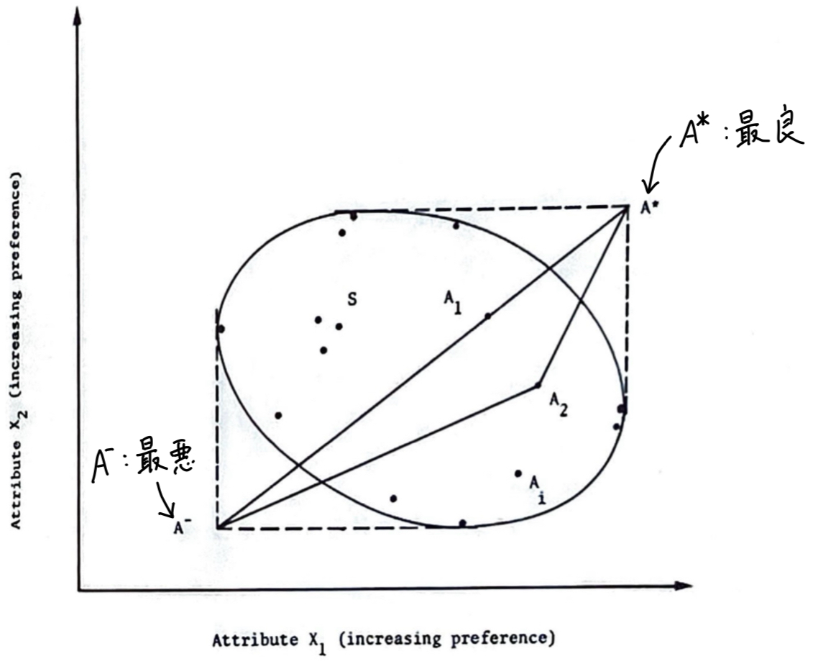

<!-- _class: title -->

# Extension of TOPSIS to determine weight of decision maker for group decision making problems with uncertain information
  
Zhongliang Yue
Guangdong Ocean University
Expert Systems with Applications 39 (2012)

---

# 構成

- TOPSIS について
  - 多属性意思決定
  - TOPSIS の概要
  - TOPSIS の手続き
- 研究の概要
- 関連研究

---

# 多属性意思決定 (MADM)

**M**ulti **A**ttribute **D**ecision **M**aking

複数の属性（評価基準）を持ついくつかの代替案から**最適**なものを選ぶ.
AHP, TOPSIS, SMART などの方法がある.

**例）** 家を買う際に価格, 立地, 広さといった複数の属性を考慮して最適な選択を行う.

| 代替案 | 価格 (万円) | 駅からの距離 (km) | 広さ ($\mathrm{m}^2$) |
|-------|------------|-----------------------|----------|
| 家 A  | 2500       | 0.5                   | 100      |
| 家 B  | 1800       | 1.2                   | 80       |
| 家 C  | 2200       | 0.8                   | 90       |

---

# TOPSIS の概要

**T**echnique for **O**rder **P**reference by **S**imilarity to **I**deal **S**olution
（理想解との類似度による順序付け手法）

理想的な解に近く, 考えうる最悪の解から遠い解（負の理想解）を選ぶ.

**例）**

| 代替案 | 価格 (万円) | 駅からの距離 (km) | 広さ ($\mathrm{m}^2$) |
|-------|------------|-----------------------|----------|
| 家 A  | 2500       | 0.5                   | 100      |
| 家 B  | 1800       | 1.2                   | 80       |
| 家 C  | 2200       | 0.8                   | 90       |
| 理想解  | 1800       | 0.5                   | 100      |
| 負の理想解  | 2500       | 1.2                   | 80       |

---

# TOPSIS の概要

$A_1$ は $A_2$ よりも理想的な解 $A^*$ に近いが, 負の理想解 $A^-$ にもより近い.
$\qquad$ → 理想解からの距離と負の理想解からの距離とのバランスの取れた解を選ぶ.

---

# TOPSIS の手続き

$m$ 個の代替案 $A_1, A_2, \ldots, A_m$ があり, $n$ 個の属性 $X_1, X_2, \ldots, X_n$ があるとする.
代替案 $i$ の属性 $j$ の値を $x_{ij}$ とする.

|  | $X_1$ | $X_2$ | $\cdots$ | $X_j$ | $\cdots$ | $X_n$ |
|---|-------|-------|----------|-------|----------|-------|
| $A_1$ | $x_{11}$ | $x_{12}$ | $\cdots$ | $x_{1j}$ | $\cdots$ | $x_{1n}$ |
| $A_2$ | $x_{21}$ | $x_{22}$ | $\cdots$ | $x_{2j}$ | $\cdots$ | $x_{2n}$ |
| $\vdots$ | $\vdots$ | $\vdots$ | $\ddots$ | $\vdots$ | $\ddots$ | $\vdots$ |
| $A_i$ | $x_{i1}$ | $x_{i2}$ | $\cdots$ | $x_{ij}$ | $\cdots$ | $x_{in}$ |
| $\vdots$ | $\vdots$ | $\vdots$ | $\ddots$ | $\vdots$ | $\ddots$ | $\vdots$ |
| $A_m$ | $x_{m1}$ | $x_{m2}$ | $\cdots$ | $x_{mj}$ | $\cdots$ | $x_{mn}$ |

---

# TOPSIS の手続き

## ステップ 1: 決定行列の作成・正規化

次のように決定行列 $D$ を作成する.

$$
D =
\left( x_{ij} \right)_{n \times n} =
\begin{bmatrix}
x_{11} & x_{12} & \cdots & x_{1j} & \cdots & x_{1n} \\
x_{21} & x_{22} & \cdots & x_{2j} & \cdots & x_{2n} \\
\vdots & \vdots & \ddots & \vdots & \ddots & \vdots \\
x_{i1} & x_{i2} & \cdots & x_{ij} & \cdots & x_{in} \\
\vdots & \vdots & \ddots & \vdots & \ddots & \vdots \\
x_{m1} & x_{m2} & \cdots & x_{mj} & \cdots & x_{mn} \\
\end{bmatrix}
$$

---

# TOPSIS の手続き

## ステップ 1: 決定行列の作成・正規化

$D$ を列（属性）ごとに正規化して, 正規化決定行列 $R = \left( r_{ij} \right)_{n \times n}$ を作成する.

$$
r_{ij} = \frac{x_{ij}}{\sqrt{\sum_{i=1}^m x_{ij}^2}},
\quad i = 1, 2, \ldots, m, ~~ j = 1, 2, \ldots, n
$$

ベクトル $r_j = \left( r_{1j}, r_{2j}, \ldots, r_{mj} \right), ~~ j = 1, 2, \ldots, n$ のノルム $\left\| r_j \right\|_2$ は $1$ になる.

---

# TOPSIS の手続き

## ステップ 2: 属性ごとに重み付け

意思決定者が重みベクトル $w = \left( w_1, w_2, \ldots, w_n \right), ~~ w_j \geq 0, ~~ \sum_{j=1}^n w_j = 1$ を与える.
（属性 $j$ に対する重みが $w_j$.）

重みづけ正規化決定行列 $V = \left( v_{ij} \right)_{n \times n}$ を次のように作成する.

$$
v_{ij} = w_j r_{ij},
\quad i = 1, 2, \ldots, m, ~~ j = 1, 2, \ldots, n
$$

$$
V = \begin{bmatrix}
v_{11} & v_{12} & \cdots & v_{1j} & \cdots & v_{1n} \\
v_{21} & v_{22} & \cdots & v_{2j} & \cdots & v_{2n} \\
\vdots & \vdots & \ddots & \vdots & \ddots & \vdots \\
v_{i1} & v_{i2} & \cdots & v_{ij} & \cdots & v_{in} \\
\vdots & \vdots & \ddots & \vdots & \ddots & \vdots \\
v_{m1} & v_{m2} & \cdots & v_{mj} & \cdots & v_{mn} \\
\end{bmatrix} = \begin{bmatrix}
w_1 r_{11} & w_2 r_{12} & \cdots & w_n r_{1n} \\
w_1 r_{21} & w_2 r_{22} & \cdots & w_n r_{2n} \\
\vdots & \vdots & \ddots & \vdots \\
w_1 r_{i1} & w_2 r_{i2} & \cdots & w_n r_{in} \\
\vdots & \vdots & \ddots & \vdots \\
w_1 r_{m1} & w_2 r_{m2} & \cdots & w_n r_{mn} \\
\end{bmatrix}
$$

---

# TOPSIS の手続き

## ステップ 3: 理想解と負の理想解の計算

属性 $j$ が benefit (便益, 大きいほど良い) の場合, $j \in J^+$ とする.
属性 $j$ が cost (費用, 小さいほど良い) の場合, $j \in J^-$ とする.

理想解 $A^+ = \left( v_1^+, v_2^+, \ldots, v_n^+ \right)$, 負の理想解 $A^- = \left( v_1^-, v_2^-, \ldots, v_n^- \right)$ を次のように計算する.

$$
v_j^+ = \begin{cases}
\max_{i=1, 2, \ldots, m} v_{ij} & \text{if} \quad j \in J^+ \\
\min_{i=1, 2, \ldots, m} v_{ij} & \text{if} \quad j \in J^-
\end{cases}
$$

$$
v_j^- = \begin{cases}
\min_{i=1, 2, \ldots, m} v_{ij} & \text{if} \quad j \in J^+ \\
\max_{i=1, 2, \ldots, m} v_{ij} & \text{if} \quad j \in J^-
\end{cases}
$$

---

# TOPSIS の手続き

## ステップ 4: 分離尺度 (separation measure) の計算

ユークリッド距離で各代替案 $A_i$ と理想解 $A^+$, 負の理想解 $A^-$ との分離尺度を計算する.

$$
S_i^+ = \sqrt{\sum_{j=1}^n \left( v_{ij} - v_j^+ \right)^2},
\quad S_i^- = \sqrt{\sum_{j=1}^n \left( v_{ij} - v_j^- \right)^2},
\quad i = 1, 2, \ldots, m
$$

---

# TOPSIS の手続き

## ステップ 5: 理想解との相対近接度 (relative closeness) の計算

各代替案 $A_i$ に対して, 理想解 $A^+$ に対する相対近接度 $\mathrm{RC}_i$ を次のように計算する.

$$
\mathrm{RC}_i = \frac{S_i^-}{S_i^+ + S_i^-},
\quad i = 1, 2, \ldots, m
$$

- $\mathrm{RC}_i$ が大きいほど, 代替案 $A_i$ は理想解 $A^+$ に近い.
- $0 < \mathrm{RC}_i < 1$.
- $A_i = A^+$ のとき, $\mathrm{RC}_i = 1$.
- $A_i = A^-$ のとき, $\mathrm{RC}_i = 0$.

---

# TOPSIS の手続き

## ステップ 6: 順序付け

相対近接度 $\mathrm{RC}_i, ~~ i = 1, 2, \ldots, m$ が大きい順に代替案を順序付ける.

---

# 研究の概要

## 問題設定

- **多属性意思決定問題**
- 複数の意思決定者がいる（**グループ**意思決定）
  - 意思決定者それぞれが属性の重みを与える
  - 意思決定者の重みを計算する
- 決定行列の要素が**区間**で与えられる
  - 例）大気中の汚染物質の濃度が $[0.002, 0.219]$ の範囲
- TOPSIS の枠組みで取り扱い, 最終的に一つの代替案の順位付けを求める

---

# 研究の概要

