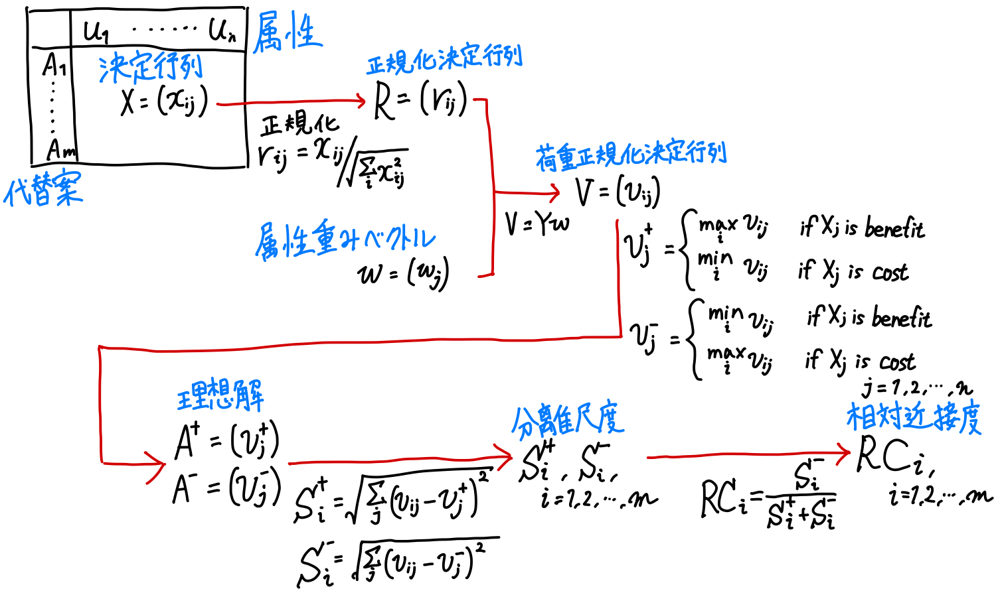
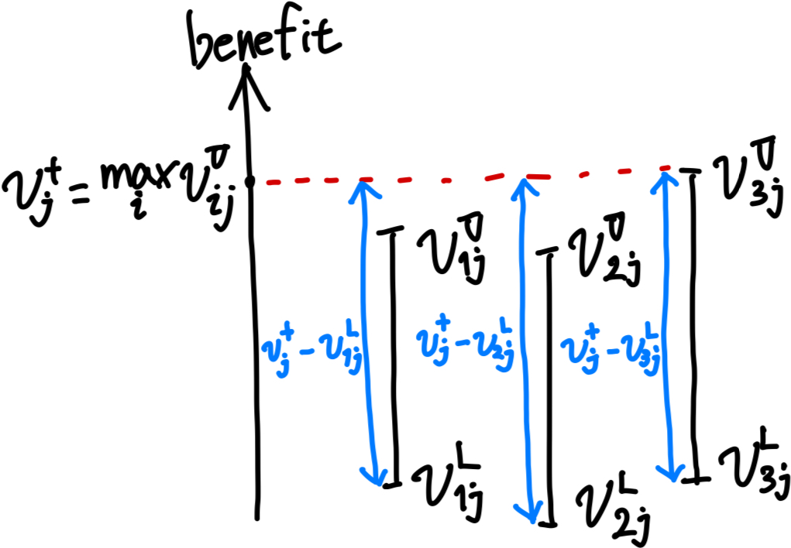

<!-- _class: title -->

# An extended TOPSIS for determining weights of decision makers with interval numbers
  
Zhongliang Yue
Guangdong Ocean University
Expert Systems with Applications 39 (2012)

---

# 構成

- TOPSIS について（多属性意思決定, TOPSIS の概要, TOPSIS の手続き）
- 研究の概要
- 関連研究 ([40] 区間の属性値を扱う TOPSIS, H.S. Shiha & H. Shyurb (2007))
- 理論的準備
- 提案手法
- 数値例
- 結論

---

# 多属性意思決定 (MADM)

**M**ulti **A**ttribute **D**ecision **M**aking

複数の属性（評価基準）を持ついくつかの代替案から**最適**なものを選ぶ.
AHP, TOPSIS, SMART などの方法がある.

**例）** 家を買う際に価格, 立地, 広さといった複数の属性を考慮して最適な選択を行う.

| 代替案 | 価格 (万円) | 駅からの距離 (km) | 広さ ($\mathrm{m}^2$) |
|-------|------------|-----------------------|----------|
| 家 A  | 2500       | 0.5                   | 100      |
| 家 B  | 1800       | 1.2                   | 80       |
| 家 C  | 2200       | 0.8                   | 90       |

---

# TOPSIS の概要 [15]

**T**echnique for **O**rder **P**reference by **S**imilarity to **I**deal **S**olution
（理想解との類似度による順序付け手法）

理想的な解に近く, 考えうる最悪の解から遠い解（負の理想解）を選ぶ.

**例）**

| 代替案 | 価格 (万円) | 駅からの距離 (km) | 広さ ($\mathrm{m}^2$) |
|-------|------------|-----------------------|----------|
| 家 A  | 2500       | 0.5                   | 100      |
| 家 B  | 1800       | 1.2                   | 80       |
| 家 C  | 2200       | 0.8                   | 90       |
| 理想解  | 1800       | 0.5                   | 100      |
| 負の理想解  | 2500       | 1.2                   | 80       |

---

# TOPSIS の概要 [15]

$A_1$ は $A_2$ よりも理想的な解 $A^*$ に近いが, 負の理想解 $A^-$ にもより近い.
$\qquad$ → 理想解からの距離と負の理想解からの距離とのバランスの取れた解を選ぶ.

---

# TOPSIS の手続き [15]

$m$ 個の代替案 $A_1, A_2, \ldots, A_m$ があり, $n$ 個の属性 $X_1, X_2, \ldots, X_n$ があるとする.
代替案 $i$ の属性 $j$ の値を $x_{ij}$ とする.

|  | $X_1$ | $X_2$ | $\cdots$ | $X_j$ | $\cdots$ | $X_n$ |
|---|-------|-------|----------|-------|----------|-------|
| $A_1$ | $x_{11}$ | $x_{12}$ | $\cdots$ | $x_{1j}$ | $\cdots$ | $x_{1n}$ |
| $A_2$ | $x_{21}$ | $x_{22}$ | $\cdots$ | $x_{2j}$ | $\cdots$ | $x_{2n}$ |
| $\vdots$ | $\vdots$ | $\vdots$ | $\ddots$ | $\vdots$ | $\ddots$ | $\vdots$ |
| $A_i$ | $x_{i1}$ | $x_{i2}$ | $\cdots$ | $x_{ij}$ | $\cdots$ | $x_{in}$ |
| $\vdots$ | $\vdots$ | $\vdots$ | $\ddots$ | $\vdots$ | $\ddots$ | $\vdots$ |
| $A_m$ | $x_{m1}$ | $x_{m2}$ | $\cdots$ | $x_{mj}$ | $\cdots$ | $x_{mn}$ |

---

# TOPSIS の手続き [15]

## ステップ 1: 決定行列の作成・正規化

次のように決定行列 $D$ を作成する.

$$
D =
\left( x_{ij} \right)_{m \times n} =
\begin{bmatrix}
x_{11} & x_{12} & \cdots & x_{1j} & \cdots & x_{1n} \\
x_{21} & x_{22} & \cdots & x_{2j} & \cdots & x_{2n} \\
\vdots & \vdots & \ddots & \vdots & \ddots & \vdots \\
x_{i1} & x_{i2} & \cdots & x_{ij} & \cdots & x_{in} \\
\vdots & \vdots & \ddots & \vdots & \ddots & \vdots \\
x_{m1} & x_{m2} & \cdots & x_{mj} & \cdots & x_{mn} \\
\end{bmatrix}
$$

---

# TOPSIS の手続き [15]

## ステップ 1: 決定行列の作成・正規化

$D$ を列（属性）ごとに正規化して, 正規化決定行列 $R = \left( r_{ij} \right)_{m \times n}$ を作成する.

$$
r_{ij} = \frac{x_{ij}}{\sqrt{\sum_{i=1}^m x_{ij}^2}},
\quad i = 1, 2, \ldots, m, ~~ j = 1, 2, \ldots, n
$$

ベクトル $r_j = \left( r_{1j}, r_{2j}, \ldots, r_{mj} \right), ~~ j = 1, 2, \ldots, n$ のノルム $\left\| r_j \right\|_2$ は $1$ になる.

---

# TOPSIS の手続き [15]

## ステップ 2: 属性ごとに重み付け

意思決定者が重みベクトル $w = \left( w_1, w_2, \ldots, w_n \right), ~~ w_j \geq 0, ~~ \sum_{j=1}^n w_j = 1$ を与える.
（属性 $j$ に対する重みが $w_j$.）

重みづけ正規化決定行列 $V = \left( v_{ij} \right)_{m \times n}$ を次のように作成する.

$$
v_{ij} = w_j r_{ij},
\quad i = 1, 2, \ldots, m, ~~ j = 1, 2, \ldots, n
$$

$$
V = \begin{bmatrix}
v_{11} & v_{12} & \cdots & v_{1j} & \cdots & v_{1n} \\
v_{21} & v_{22} & \cdots & v_{2j} & \cdots & v_{2n} \\
\vdots & \vdots & \ddots & \vdots & \ddots & \vdots \\
v_{i1} & v_{i2} & \cdots & v_{ij} & \cdots & v_{in} \\
\vdots & \vdots & \ddots & \vdots & \ddots & \vdots \\
v_{m1} & v_{m2} & \cdots & v_{mj} & \cdots & v_{mn} \\
\end{bmatrix} = \begin{bmatrix}
w_1 r_{11} & w_2 r_{12} & \cdots & w_n r_{1n} \\
w_1 r_{21} & w_2 r_{22} & \cdots & w_n r_{2n} \\
\vdots & \vdots & \ddots & \vdots \\
w_1 r_{i1} & w_2 r_{i2} & \cdots & w_n r_{in} \\
\vdots & \vdots & \ddots & \vdots \\
w_1 r_{m1} & w_2 r_{m2} & \cdots & w_n r_{mn} \\
\end{bmatrix}
$$

---

# TOPSIS の手続き [15]

## ステップ 3: 理想解と負の理想解の計算

属性 $j$ が benefit (便益, 大きいほど良い) の場合, $j \in J^+$ とする.
属性 $j$ が cost (費用, 小さいほど良い) の場合, $j \in J^-$ とする.

理想解 $A^+ = \left( v_1^+, v_2^+, \ldots, v_n^+ \right)$, 負の理想解 $A^- = \left( v_1^-, v_2^-, \ldots, v_n^- \right)$ を次のように計算する.

$$
v_j^+ = \begin{cases}
\max_{i=1, 2, \ldots, m} v_{ij} & \text{if} \quad j \in J^+ \\
\min_{i=1, 2, \ldots, m} v_{ij} & \text{if} \quad j \in J^-
\end{cases}
$$

$$
v_j^- = \begin{cases}
\min_{i=1, 2, \ldots, m} v_{ij} & \text{if} \quad j \in J^+ \\
\max_{i=1, 2, \ldots, m} v_{ij} & \text{if} \quad j \in J^-
\end{cases}
$$

---

# TOPSIS の手続き [15]

## ステップ 4: 分離尺度 (separation measure) の計算

ユークリッド距離で各代替案 $A_i$ と理想解 $A^+$ との分離尺度 $S_i^+$, 負の理想解 $A^-$ との分離尺度 $S_i^-$ を計算する.

$$
S_i^+ = \sqrt{\sum_{j=1}^n \left( v_{ij} - v_j^+ \right)^2},
\quad S_i^- = \sqrt{\sum_{j=1}^n \left( v_{ij} - v_j^- \right)^2},
\quad i = 1, 2, \ldots, m
$$

---

# TOPSIS の手続き [15]

## ステップ 5: 理想解との相対近接度 (relative closeness) の計算

各代替案 $A_i$ に対して, 理想解 $A^+$ に対する相対近接度 $\mathrm{RC}_i$ を次のように計算する.

$$
\mathrm{RC}_i = \frac{S_i^-}{S_i^+ + S_i^-},
\quad i = 1, 2, \ldots, m
$$

- $\mathrm{RC}_i$ が大きいほど, 代替案 $A_i$ は理想解 $A^+$ に近い.
- $0 < \mathrm{RC}_i < 1$.
- $A_i = A^+$ のとき $\mathrm{RC}_i = 1$.
- $A_i = A^-$ のとき $\mathrm{RC}_i = 0$.

---

# TOPSIS の手続き [15]

## ステップ 6: 順序付け

相対近接度 $\mathrm{RC}_i, ~~ i = 1, 2, \ldots, m$ が大きい順に代替案を順序付ける.

---

# 提案手法
.

---

# 数値例

### ステップ 1: 決定行列の作成・正規化

| 代替案 | 価格 (万円) | 駅からの距離 (km) | 広さ ($\mathrm{m}^2$) |
|-------|------------|-----------------------|----------|
| 家 A  | 2500       | 0.5                   | 100      |
| 家 B  | 1800       | 1.2                   | 80       |
| 家 C  | 2200       | 0.8                   | 90       |

決定行列 $D$, 正規化決定行列 $R$ は次のようになる.
$$
D = \begin{bmatrix}
2500 & 0.5 & 100 \\
1800 & 1.2 & 80 \\
2200 & 0.8 & 90
\end{bmatrix}, \quad
R = \begin{bmatrix}
0.6604 & 0.3276 & 0.6389 \\
0.4755 & 0.7861 & 0.5111 \\
0.5812 & 0.5241 & 0.5750
\end{bmatrix}
$$

---

# 数値例

### ステップ 2: 属性ごとに重み付け

属性の重みを $w = \left( 0.3, 0.4, 0.3 \right)^\mathrm{T}$ とする.

$$
V = R I_3 w = \begin{bmatrix}
0.1981 & 0.1902 & 0.1744 \\
0.0983 & 0.3144 & 0.1572 \\
​0.1917 & 0.2096 & 0.1725 \\
\end{bmatrix}
$$

## ステップ 3: 理想解と負の理想解の計算

| 代替案 | 価格 (万円) | 駅からの距離 (km) | 広さ ($\mathrm{m}^2$) |
|-------|------------|-----------------------|----------|
| cost/benefit | cost | cost | benefit |
| 理想解 $A^+$  | 0.0983       | 0.1902                   | 0.1744     |
| 負の理想解 $A^-$  | 0.1981      | 0.3144                   | 0.1572       |

---

# 数値例

### ステップ 4: 分離尺度の計算

$$
S_1^+ = 0.1173, ~~
S_2^+ = 0.1336, ~~
S_3^+ = 0.0785, \\
S_1^- = 0.1866, ~~
S_2^- = 0.0556, ~~
S_3^- = 0.1085, ~~
$$

### ステップ 5: 理想解との相対近接度の計算

$$
\mathrm{RC}_1 = 0.6140, ~~
\mathrm{RC}_2 = 0.2939, ~~
\mathrm{RC}_3 = 0.5892
$$

### ステップ 6: 順序付け

$A_1 \succ A_3 \succ A_2$ の順になる.

---

# 研究の概要

## 問題設定

- **多属性意思決定問題**
- 複数の意思決定者がいる（**グループ**意思決定）
  - 意思決定者それぞれが属性の重みを与える
  - 意思決定者の重みを計算する
- 決定行列の要素が**区間**で与えられる
  - 例）大気中の汚染物質の濃度が $[0.002, 0.219]$ の範囲
- TOPSIS の枠組みで取り扱い, 最終的に一つの代替案の順位付けを求める

---

# 関連研究

- [15] C.L. Hwang, K. Yoon (1981)
TOPSIS の提案
- [40] G.R. Jahanshahloo, F. Hosseinzadeh Lotfi, M. Izadikhah (2006)
区間の属性値を扱う TOPSIS
- [41] F. Ye, Y.N. Li (2009), **H.S. Shiha & H. Shyurb (2007)**
グループ意思決定問題における TOPSIS

---

# 関連研究 - [40] 区間の属性値を扱う TOPSIS

## ステップ 1: 決定行列の作成・正規化

決定行列 $D$ の成分が区間になっている.
$$
D = \left( \left[ x_{ij}^\mathrm{L}, x_{ij}^\mathrm{U} \right] \right)_{m \times n}
$$

正規化決定行列 $R = \left( \left[ r_{ij}^\mathrm{L}, r_{ij}^\mathrm{U} \right] \right)_{m \times n}$ を次のように計算する.
$$
r_{ij}^\mathrm{L} = \frac{x_{ij}^\mathrm{L}}{\sqrt{\sum_{i=1}^m \left( \left( x_{ij}^\mathrm{L} \right)^2 + \left( x_{ij}^\mathrm{U} \right)^2 \right)}}, \quad
r_{ij}^\mathrm{U} = \frac{x_{ij}^\mathrm{U}}{\sqrt{\sum_{i=1}^m \left( \left( x_{ij}^\mathrm{L} \right)^2 + \left( x_{ij}^\mathrm{U} \right)^2 \right)}}, \quad
i = 1, 2, \ldots, m, ~~ j = 1, 2, \ldots, n
$$
この正規化で $\left[ r_{ij}^\mathrm{L}, r_{ij}^\mathrm{U} \right] \subseteq [0, 1]$ となることが保証される.

---

# 関連研究 - [40] 区間の属性値を扱う TOPSIS

## ステップ 2: 属性ごとに重み付け

属性値が crisp の場合と同様.

意思決定者が crisp 重みベクトル $w = \left( w_1, w_2, \ldots, w_n \right), ~~ w_j \geq 0, ~~ \sum_{j=1}^n w_j = 1$ を与える.

重みづけ正規化決定行列 $V = \left( \left[ v_{ij}^\mathrm{L}, v_{ij}^\mathrm{U} \right] \right)_{m \times n}$ を次のように作成する.

$$
v_{ij} = \left[ w_j r_{ij}^\mathrm{L}, w_j r_{ij}^\mathrm{U} \right],
\quad i = 1, 2, \ldots, m, ~~ j = 1, 2, \ldots, n
$$

---

# 関連研究 - [40] 区間の属性値を扱う TOPSIS

## ステップ 3: 理想解と負の理想解の計算

属性 $j$ が benefit (便益, 大きいほど良い) の場合, $j \in J^+$ とする.
属性 $j$ が cost (費用, 小さいほど良い) の場合, $j \in J^-$ とする.

理想解 $A^+ = \left( v_1^+, v_2^+, \ldots, v_n^+ \right)$, 負の理想解 $A^- = \left( v_1^-, v_2^-, \ldots, v_n^- \right)$ を次のように計算する.

$$
v_j^+ = \begin{cases}
\max_{i=1, 2, \ldots, m} v_{ij}^\mathrm{U} & \text{if} \quad j \in J^+ \\
\min_{i=1, 2, \ldots, m} v_{ij}^\mathrm{L} & \text{if} \quad j \in J^-
\end{cases}
$$

$$
v_j^- = \begin{cases}
\min_{i=1, 2, \ldots, m} v_{ij}^\mathrm{L} & \text{if} \quad j \in J^+ \\
\max_{i=1, 2, \ldots, m} v_{ij}^\mathrm{U} & \text{if} \quad j \in J^-
\end{cases}
$$

---

# 関連研究 - [40] 区間の属性値を扱う TOPSIS

## ステップ 4: 分離尺度 (separation measure) の計算

ユークリッド距離で各代替案 $A_i$ と理想解 $A^+$ との分離尺度 $S_i^+$, 負の理想解 $A^-$ との分離尺度 $S_i^-$ を計算する.

$$
\begin{align*}
S_i^+ &= \sqrt{ \sum_{j \in J^+} \left( v_{j}^+ - v_{ij}^\mathrm{L} \right)^2 + \sum_{j \in J^-} \left( v_{ij}^\mathrm{U} - v_{j}^+ \right)^2 }, \quad 
S_i^- = \sqrt{ \sum_{j \in J^+} \left( v_{ij}^\mathrm{U} - v_{j}^- \right)^2 + \sum_{j \in J^-} \left( v_{j}^- - v_{ij}^\mathrm{L} \right)^2 }, \\
& \qquad \qquad i = 1, 2, \ldots, m
\end{align*}
$$

## ステップ 5, 6

crisp の場合と同様.

---

# 関連研究 - [40] 区間の属性値を扱う TOPSIS

## ステップ 3, 4

$j \in J^+$ の場合

---

# 関連研究 - グループ意思決定問題における TOPSIS

## H.S. Shiha & H. Shyurb (2007)

$K$ 人の意思決定者がそれぞれ決定行列 $D^k$ と重みベクトル $w^k$ を与える.

理想解との相対近接度 (relative closeness) の計算 (ステップ 5) までは $D^k, w^k$ から意思決定者ごとに個別で計算する.
意思決定者ごとに計算した相対近接度 $S_i^{k-}, S_i^{k+}, ~ i = 1, 2, \ldots, m$ を幾何平均で統合する.

$$
S_i^+ = \left( \prod_{k=1}^K S_i^{k+} \right)^\frac{1}{K},
\quad S_i^- = \left( \prod_{k=1}^K S_i^{k-} \right)^{\frac{1}{K}},
\quad i = 1, 2, \ldots, m
$$

---

# 理論的準備

## 定義 1. 非負の区間

$a = \left[ a^\mathrm{L}, a^\mathrm{U} \right] = \left\{ x ~ | ~ a^\mathrm{L} \leq x \leq a^\mathrm{U} \right\}$ を非負の区間と呼ぶ.

## 定義 2. 区間の演算

$a = \left[ a^\mathrm{L}, a^\mathrm{U} \right], b = \left[ b^\mathrm{L}, b^\mathrm{U} \right]$ を非負の区間とする.
$\lambda \geq 0$ をスカラーとする.
次のように区間の演算を定義する.

1. $a = b \Leftrightarrow a^\mathrm{L} = b^\mathrm{L} \text{ and } a^\mathrm{U} = b^\mathrm{U}$
2. $a + b = \left[ a^\mathrm{L} + b^\mathrm{L}, a^\mathrm{U} + b^\mathrm{U} \right]$
3. $\lambda a = \left[ \lambda a^\mathrm{L}, \lambda a^\mathrm{U} \right]$

---

# 理論的準備

$\Omega$ をすべての非負の区間の集合とする.

## 定義 3. 区間の加重平均

$a_i = \left[ a_i^\mathrm{L}, a_i^\mathrm{U} \right], ~ i = 1, 2, \ldots, n$ を非負の区間とする.
$w = \left( w_1, w_2, \ldots, w_n \right), ~~ \sum_{i=1}^n w_i = 1, ~~ w_i \geq 0 (i = 1, 2, \ldots, n)$ を重みベクトルとする.
このとき, $a_i, ~ i = 1, 2, \ldots, n$ の加重平均 $\mathrm{WA}(a, w)$ を次のように定義する.

$$
\mathrm{WA}(a, w) = \left[ \sum_{i=1}^n w_i a_i^\mathrm{L}, \sum_{i=1}^n w_i a_i^\mathrm{U} \right]
$$

---

# 理論的準備

## 定義 4. 区間の大小関係

$a = \left[ a^\mathrm{L}, a^\mathrm{U} \right], b = \left[ b^\mathrm{L}, b^\mathrm{U} \right]$ を非負の区間とする.
$|a| = a^\mathrm{U} - a^\mathrm{L}, |b| = b^\mathrm{U} - b^\mathrm{L}$ とする.
このとき $a \leq b$ の可能性度 (degree of possibility of $a \leq b$) $p(q \leq b)$ を次のように定義する.

$$
p(a \leq b) = \max \left( 0, ~~ 1 - \max\left(0, ~~ \frac{b^\mathrm{U} - a^\mathrm{L}}{|a| + |b|}\right) \right)
$$

1. $0 \leq p(a \leq b) \leq 1$
2. $p(a \leq b) = 1 \Leftrightarrow a^\mathrm{L} \geq b^\mathrm{U}$
3. $p(a \leq b) = 0 \Leftrightarrow a^\mathrm{U} \leq b^\mathrm{L}$
4. $p(a \leq a) = 1/2$
5. $p(a \leq b) + p(b \leq a) = 1$

---

# 理論的準備

非負の区間 $a_i = \left[ a_i^\mathrm{L}, a_i^\mathrm{U} \right]$ と重みベクトル $w = \left( w_1, w_2, \ldots, w_n \right), ~~ \sum_{i=1}^n w_i = 1, ~~ w_i \geq 0 ~ (i = 1, 2, \ldots, n)$ に対して, $p$ によってベクトル $p(a_i, w) = \left( p_i \right)_m$ を次のように定義する.

$$
p_i = \sum_{j=1}^m p(a_i \geq a_j), \quad i = 1, 2, \ldots, m
$$

$p$ の値によって, 代替案の順位付けを行う.

---

# 提案手法

## 問題設定

| 文字 | 意味 |
|---|---|
| $m$ | 代替案の数 |
| $A = \left\{ A_1, A_2, \ldots, A_m \right\}$ | 代替案の集合 |
| $n$ | 属性の数 |
| $U = \left\{ u_1, u_2, \ldots, u_n \right\}$ | 属性の集合 |
| $t$ | 意思決定者の人数 |
| $D = \left\{ d_1, d_2, \ldots, d_t \right\}$ | 意思決定者の集合 |
| $w_k = \left( w^k_1, w^k_2, \ldots, w^k_n \right)$ | 意思決定者 $d_k$ が与える属性の重みベクトル |
| $\lambda = \left( \lambda_1, \lambda_2, \ldots, \lambda_t \right)$ | 意思決定者の重みベクトル |

---

# 提案手法

## ステップ 1: 決定行列の作成・正規化

### 決定行列の作成

各意思決定者が区間決定行列を与える.
意思決定者 $d_k \in D$ が与える区間決定行列を $X_k = \left( x_{ij}^k \right)_{m \times n} = \left( \left[ x_{ij}^{k(\mathrm{L})}, x_{ij}^{k(\mathrm{U})} \right] \right)_{m \times n}$ とする.

<!-- ---

# 提案手法

## ステップ 1: 決定行列の作成・正規化

### 決定行列の正規化

正規化は二段階で行う.
第一段階では次の操作を行い, $Y_k = \left( \left[ y_{ij}^{k(\mathrm{L})}, y_{ij}^{k(\mathrm{U})} \right] \right)_{m \times n}$ を作成する [46].

$$
y_{ij}^{k(\mathrm{L})} = \begin{cases}
\frac{x_{ij}^{k(\mathrm{L})}}{\sum_{i=1}^m x_{ij}^{k(\mathrm{U})}}, & \text{if } u_i \text{ is benefit} \\
\frac{1/x_{ij}^{k(\mathrm{U})}}{\sum_{i=1}^m 1/x_{ij}^{k(\mathrm{L})}}, & \text{if } u_i \text{ is cost}
\end{cases}, \quad
y_{ij}^{k(\mathrm{U})} = \begin{cases}
\frac{x_{ij}^{k(\mathrm{U})}}{\sum_{i=1}^m x_{ij}^{k(\mathrm{L})}}, & \text{if } u_i \text{ is benefit} \\
\frac{1/x_{ij}^{k(\mathrm{L})}}{\sum_{i=1}^m 1/x_{ij}^{k(\mathrm{U})}}, & \text{if } u_i \text{ is cost}
\end{cases}, \\
i \in M, ~~ j \in N, ~~ k = 1, 2, \ldots, t
$$

この操作で属性の次元が打ち消され, 無次元になる.
しかし, $Y_k$ の成分の区間は $[0, 1]$ に必ずしも収まらない. -->

---

# 提案手法

## ステップ 1: 決定行列の作成・正規化

### 決定行列の正規化

次の操作を行い, 正規化決定行列 $R_k = \left( \left[ r_{ij}^{k(\mathrm{L})}, r_{ij}^{k(\mathrm{U})} \right] \right)_{m \times n}$ を作成する [40].

$$
r_{ij}^{k(\mathrm{L})} = \frac{x_{ij}^{k(\mathrm{L})}}{\sqrt{\sum_{i=1}^m \left( \left( x_{ij}^{k(\mathrm{L})} \right)^2 + \left( x_{ij}^{k(\mathrm{U})} \right)^2 \right)}}
$$

- $\left[ r_{ij}^{k(\mathrm{L})}, r_{ij}^{k(\mathrm{U})} \right] \subseteq [0, 1]$
- $r_{ij}^{k(\mathrm{L})}, r_{ij}^{k(\mathrm{U})}$ は無次元

---

# 提案手法

## ステップ 1: 決定行列の作成・正規化

$r_{ij}^k = x_{ij}^k / \sqrt{ \sum_{i = 1}^m \left( x_{ij}^k \right)^2 }$ ではない.

$$
\begin{align*}
\frac{x_{ij}^k}{\sqrt{ \sum_{i = 1}^m \left( x_{ij}^k \right)^2 }}
& = \frac{\left[ x_{ij}^{k(\mathrm{L})}, x_{ij}^{k(\mathrm{U})} \right]}{\sqrt{ \sum_{i = 1}^m \left( \left[ x_{ij}^{k(\mathrm{L})}, x_{ij}^{k(\mathrm{U})} \right] \right)^2 }}
= \frac{\left[ x_{ij}^{k(\mathrm{L})}, x_{ij}^{k(\mathrm{U})} \right]}{\left[ \sqrt{\sum_{i=1}^m \left( x_{ij}^{k(\mathrm{L})} \right)^2}, \sqrt{\sum_{i=1}^m \left( x_{ij}^{k(\mathrm{U})} \right)^2} \right] } \\
& \qquad = \left[ \frac{x_{ij}^{k(\mathrm{L})}}{\sqrt{\sum_{i=1}^m \left( x_{ij}^{k(\mathrm{U})} \right)^2}}, \frac{x_{ij}^{k(\mathrm{U})}}{\sqrt{\sum_{i=1}^m \left( x_{ij}^{k(\mathrm{L})} \right)^2}} \right]
\end{align*}
$$

$\sqrt{\sum_{i=1}^m \left( \left( x_{ij}^{k(\mathrm{L})} \right)^2 + \left( x_{ij}^{k(\mathrm{U})} \right)^2 \right)}$ は $\left( x_{1j}^{k(\mathrm{L})}, x_{1j}^{k(\mathrm{U})}, x_{2j}^{k(\mathrm{L})}, x_{2j}^{k(\mathrm{U})}, \ldots, x_{mj}^{k(\mathrm{L})}, x_{mj}^{k(\mathrm{U})} \right)$ のノルム.

---

# 提案手法

## ステップ 2: 属性ごとに重み付け

各意思決定者が crisp 重みベクトル 
$w_k = \left( w^k_1, w^k_2, \ldots, w^k_n \right), ~~ w^k_j \geq 0, ~~ \sum_{j=1}^n w^k_j = 1$ を与える.

重みづけ正規化決定行列 $V_k = \left( \left[ v_{ij}^{k(\mathrm{L})}, v_{ij}^{k(\mathrm{U})} \right] \right)_{m \times n}$ を次のように作成する.

$$
v_{ij} = \left[ w^k_j r_{ij}^{k(\mathrm{L})}, w^k_j r_{ij}^{k(\mathrm{U})} \right],
\quad i \in M, ~~ j \in N, ~~ k = 1, 2, \ldots, t
$$

---

# 提案手法

## ステップ 3: 理想解と負の理想解の計算

グループの理想解 $A^+ = \left( \left[ v_{ij}^{+(\mathrm{L})}, v_{ij}^{+(\mathrm{U})} \right] \right)_{m \times n}$, $A^- = \left( \left[ v_{ij}^{-(\mathrm{L})}, v_{ij}^{-(\mathrm{U})} \right] \right)_{m \times n}$ を計算する.

$A^+$ は上限・下限それぞれで平均をとる.

$$
v_{ij}^{+(\mathrm{L})} = \frac{1}{t} \sum_{k=1}^t v_{ij}^{k(\mathrm{L})},
\quad v_{ij}^{+(\mathrm{U})} = \frac{1}{t} \sum_{k=1}^t v_{ij}^{k(\mathrm{U})},
\quad i \in M, ~~ j \in N
$$

$A^-$ は区間の和集合をとる.

$$
v_{ij}^{-{(\mathrm{L})}} = \min_{k=1, 2, \ldots, t} v_{ij}^{k(\mathrm{L})},
\quad v_{ij}^{-{(\mathrm{U})}} = \max_{k=1, 2, \ldots, t} v_{ij}^{k(\mathrm{U})},
\quad i \in M, ~~ j \in N
$$

---

# 提案手法

## ステップ 4: 意思決定者の分離尺度 (separation measure) の計算

$V^k$ の平均 $A^+$ との近さの尺度 $S_k^+$, 極端な値を集めた $A^-$ との近さの尺度 $S_k^-$ を計算する.

$$
S_k^+ = \sqrt{\sum_{i=1}^m \sum_{j=1}^n \left( \left( v_{ij}^{k(\mathrm{L})} - v_{ij}^{+(\mathrm{L})} \right)^2 + \left( v_{ij}^{k(\mathrm{U})} - v_{ij}^{+(\mathrm{U})} \right)^2 \right)}, ~~ k = 1, 2, \ldots, t \\
\quad S_k^- = \sqrt{\sum_{i=1}^m \sum_{j=1}^n \left( \left( v_{ij}^{k(\mathrm{L})} - v_{ij}^{-(\mathrm{L})} \right)^2 + \left( v_{ij}^{k(\mathrm{U})} - v_{ij}^{-(\mathrm{U})} \right)^2 \right)}, ~~ k = 1, 2, \ldots, t
$$

---

# 提案手法

## 単純に平均をとって統合する場合と違うのか？

加重平均で決定行列を統合する場合と, 単純に平均をとって決定行列を統合する場合との違いを数値例で見る.

基本的には平均をとる場合と加重平均をとる場合で結果は変わらない.
加重平均の方が多数派に寄った結果になる.

---

# 提案手法

## ステップ 5: 意思決定者の重みの計算

次のように $S_k^+, S_k^-$ から相対近接度 $\mathrm{RC}_k$ を計算する.
$V^k$ の平均 $A^+$ に近く, 極端な値を集めた $A^-$ から遠いほど $\mathrm{RC}_k$ は大きくなる.

$$
\mathrm{RC}_k = \frac{S_k^-}{S_k^+ + S_k^-}, ~~ k = 1, 2, \ldots, t
$$

$\mathrm{RC}_k$ から意思決定者の重み $\lambda_k$ を次のように計算する.

$$
\lambda_k = \frac{\mathrm{RC}_k}{\sum_{k=1}^t \mathrm{RC}_k}, ~~ k = 1, 2, \ldots, t
$$

---

# 提案手法

## ステップ 6: 重みづけ正規化決定行列の統合

各意思決定者の重みづけ正規化決定行列 $V^k$ と重み $\lambda_k$ を用いて,
統合した重みづけ正規化決定行列 $V = \left( \left[ v_{ij}^{(\mathrm{L})}, v_{ij}^{(\mathrm{U})} \right] \right)_{m \times n}$ を次のように作成する.

$$
v_{ij}^{(\mathrm{L})} = \sum_{k=1}^t \lambda_k v_{ij}^{k(\mathrm{L})},
\quad v_{ij}^{(\mathrm{U})} = \sum_{k=1}^t \lambda_k v_{ij}^{k(\mathrm{U})},
\quad i \in M, ~~ j \in N
$$

---

# 提案手法

## ステップ 7: 代替案の順位付け

代替案 $A_i, ~ i \in M$ に対して, 次のように $v_i = \left[ v_i^{(\mathrm{L})}, v_i^{(\mathrm{U})} \right]$ を計算する.

$$
v_i = \left[ v_i^{(\mathrm{L})}, v_i^{(\mathrm{U})} \right]
= \left[ \sum_{j=1}^n v_{ij}^{(\mathrm{L})}, \sum_{j=1}^n v_{ij}^{(\mathrm{U})} \right],
\quad i \in M
$$

$v = \left( v_1, v_2, \ldots, v_m \right)$ とする.
$v_i \geq v_j$ の可能性度 $p(v_i \geq v_j)$ をそれぞれ計算して代替案の順位付けを行う.

---

# 数値例

珠江デルタ地域の大気質データを用いて, この地域の 2006, 2007, 2008 年 11 月の大気質の比較を行う.

この地域には 3 箇所の大気質監視施設があり, それぞれの施設を意思決定者とみなす.
代替案は $\{ A_1, A_2, A_3 \} = \{2006, 2007, 2008\}$ 年で,
属性は 3 つの大気汚染物質 $\{ u_1, u_2, u_3 \} = \{ \text{SO}_2, \text{NO}_2, \text{PM}_{10} \}$ である.
属性の重みは全ての意思決定者（施設）で共通とし, $w = \left( 0.4, 0.2, 0.4 \right)^\mathrm{T}$ とする.

---

# 数値例

次のような決定行列が意思決定者（施設）ごとに与えられる.

| 代替案（年） | $\text{SO}_2$ | $\text{NO}_2$ | $\text{PM}_{10}$ |
|---|---|---|---|
| $A_1$ (2006) | $\left[ 0.013, 0.129 \right]$ | $\left[ 0.028, 0.144 \right]$ | $\left[ 0.021, 0.136 \right]$ |
| $A_2$ (2007) | $\left[ 0.013, 0.107 \right]$ | $\left[ 0.038, 0.139 \right]$ | $\left[ 0.047, 0.155 \right]$ |
| $A_3$ (2008) | $\left[ 0.003, 0.042 \right]$ | $\left[ 0.018, 0.054 \right]$ | $\left[ 0.014, 0.150 \right]$ |

3 つの決定行列と属性の重みに基づき, 提案手法で代替案の順位付けを行う.

---

| 決定行列 | 代替案（年） | $\text{SO}_2$ | $\text{NO}_2$ | $\text{PM}_{10}$ |
|---|---|---|---|---|
| $V_1$ | $A_1$ (2006) | $\left[ 0.001, 0.088 \right]$ | $\left[ 0.005, 0.100 \right]$ | $\left[ 0.005, 0.215 \right]$ |
| $V_1$ | $A_2$ (2007) | $\left[ 0.001, 0.088 \right]$ | $\left[ 0.006, 0.074 \right]$ | $\left[ 0.004, 0.096 \right]$ |
| $V_1$ | $A_3$ (2008) | $\left[ 0.002, 0.380 \right]$ | $\left[ 0.014, 0.156 \right]$ | $\left[ 0.004, \underline{0.323} \right]$ |
| $V_2$ | $A_1$ (2006) | $\left[ 0.006, 0.127 \right]$ | $\left[ 0.009, 0.080 \right]$ | $\left[ 0.012, 0.209 \right]$ |
| $V_2$ | $A_2$ (2007) | $\left[ 0.008, 0.108 \right]$ | $\left[ 0.010, 0.068 \right]$ | $\left[ 0.011, 0.096 \right]$ |
| $V_2$ | $A_3$ (2008) | $\left[ 0.009, 0.363 \right]$ | $\left[ 0.009, 0.170 \right]$ | $\left[ 0.012, \underline{0.327} \right]$ |
| $V_3$ | $A_1$ (2006) | $\left[ 0.003, 0.316 \right]$ | $\left[ 0.000, 0.048 \right]$ | $\left[ 0.000, 0.382 \right]$ |
| $V_3$ | $A_2$ (2007) | $\left[ 0.007, 0.126 \right]$ | $\left[ 0.001, 0.190 \right]$ | $\left[ 0.000, 0.055 \right]$ |
| $V_3$ | $A_3$ (2008) | $\left[ 0.010, 0.210 \right]$ | $\left[ 0.001, 0.038 \right]$ | $\left[ 0.001, \underline{0.104} \right]$ |

$\lambda = (0.3563,0.3625,0.2812)^\mathrm{T}$

---

**加重平均の場合 (表 16)**

| 代替案（年） | $\text{SO}_2$ | $\text{NO}_2$ | $\text{PM}_{10}$ |
|---|---|---|---|
| $A_1$ (2006) | $\left[ 0.003, 0.166 \right]$ | $\left[ 0.005, 0.078 \right]$ | $\left[ 0.006, 0.260 \right]$ |
| $A_2$ (2007) | $\left[ 0.005, 0.106 \right]$ | $\left[ 0.006, 0.104 \right]$ | $\left[ 0.006, 0.084 \right]$ |
| $A_3$ (2008) | $\left[ 0.007, 0.326 \right]$ | $\left[ 0.009, 0.128 \right]$ | $\left[ 0.006, \underline{0.263} \right]$ |

**平均の場合**

| 代替案（年） | $\text{SO}_2$ | $\text{NO}_2$ | $\text{PM}_{10}$ |
|---|---|---|---|
| $A_1$ (2006) | $\left[ 0.003, 0.177 \right]$ | $\left[ 0.005, 0.076 \right]$ | $\left[ 0.006, 0.269 \right]$ |
| $A_2$ (2007) | $\left[ 0.005, 0.107 \right]$ | $\left[ 0.005, 0.111 \right]$ | $\left[ 0.005, 0.082 \right]$ |
| $A_3$ (2008) | $\left[ 0.007, 0.318 \right]$ | $\left[ 0.008, 0.121 \right]$ | $\left[ 0.006, \underline{0.251} \right]$ |

---

# 結論

- 区間決定行列が与えられるグループ多属性意思決定問題において意思決定者の重みを決定する手法を提案した.
    - 数値例のように決定行列の成分が区間
    - 複数の意思決定者がそれぞれ決定行列を与える
    - 意思決定者の重みを計算する
        - 平均に近く, 極端な値から遠いほど重みが大きくなる
    - 決定行列を統合する
- 順位づけのときに区間同士を比較する必要がない
    - $v_i \leq v_j$ の可能性度で考えるため

- 区間だけでなく, ファジィ数などでも同じ議論ができる
